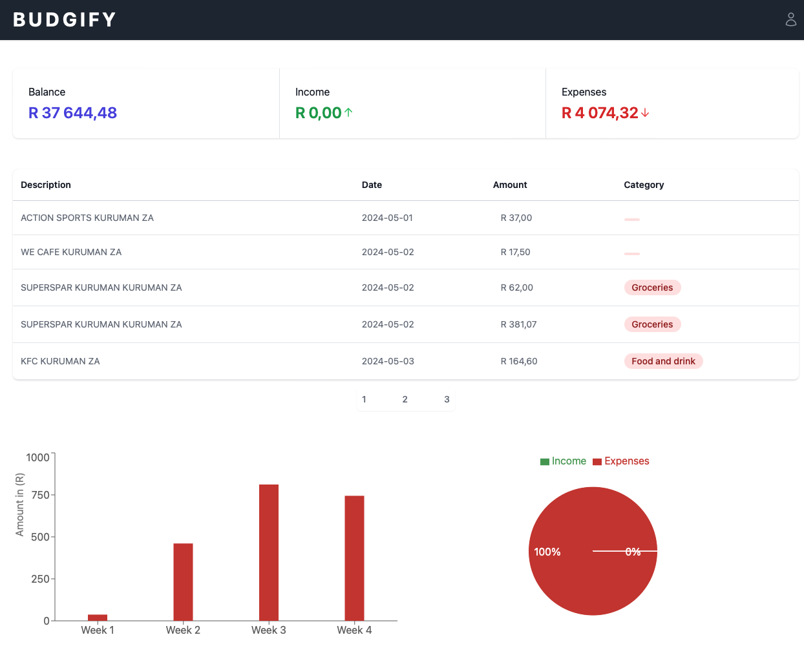

# 📊 Budgify Demo

[Budgify](https://budgify.netlify.app/) is a budgeting app that helps you manage your finances. It is a simple and easy-to-use app that allows you to track your expenses and income. You can create multiple accounts and categories to organize your finances. You can also set up recurring transactions and view detailed reports to help you make better financial decisions.

[Repository](https://github.com/Investec-Developer-Community/budgify)



## Setup

1. Clone the repository:
2. Install the dependencies:
   ```bash
   npm install
   ```
3. Create a `.env` file in the root directory of the project and add the following environment variables:
   ```bash
   API_URL=https://sandbox.api.investec.com
   ```
4. Start the development server:
   ```bash
    npm run dev
    ```
5. Navigate to http://localhost:3000 in your browser to view the app.

Sandbox credentials:
- Client Id: 'yAxzQRFX97vOcyQAwluEU6H6ePxMA5eY'
- Client Secret: '4dY0PjEYqoBrZ99r'
- API Key: 'eUF4elFSRlg5N3ZPY3lRQXdsdUVVNkg2ZVB4TUE1ZVk6YVc1MlpYTjBaV010ZW1FdGNHSXRZV05qYjNWdWRITXRjMkZ1WkdKdmVBPT0='